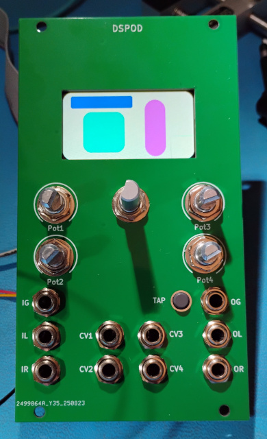

# dspod

dspod is a small ecosystem of audio DSP boards

The collection consists of the following hardware

* [dspod_module](./dspod_module) - a motherboard / carrier that adapts the standard dspod pinout
  for Eurorack, including power, I/O level buffers and user interface.
* [dspod_cv1800b](./dspod_cv1800b) - a daughterboard comprising a Sophgo/CVItek CV1800B Linux SoC
  with 64MB RAM, SD card interface, USB and GPIO + audio I/O.
* [dspod_rp2350](./Firmware/dspod_rp2350) - a daughterboard with a Raspberry Pi RP2350, 4MB flash, 8MB PSRAM, USB, GPIO and audio I/O.
* [dspod_esp32s3](./dspod_esp32s3) - a daughterboard with an ESP32 S3 processor, 4MB flash, 2MB PSRAM, USB, RF, GPIO and audio I/O.
