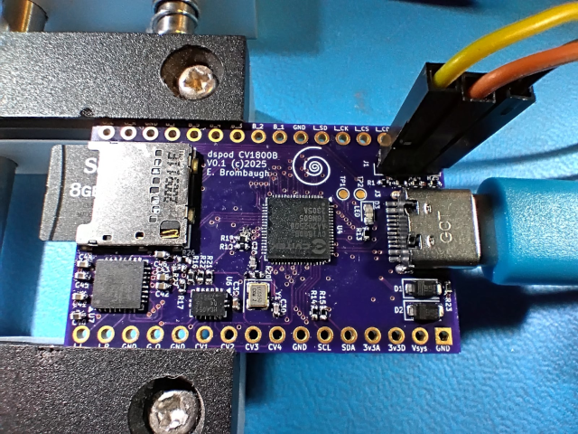

# dspod_cv1800b

The dspod_cv1800b is a daughterboard comprising a Sophon/CVItek CV1800B Linux SoC
with 64MB RAM, SD card interface, USB and GPIO + audio I/O.

## Abstract

This board is a small 32-pin device with the following features:

* CV1800B Linux SoC
  - 1GHz RISC-V primary CPU
  - 700MHz RISC-V secondary CPU
  - 8051 low-power CPU
  - 64MB SDRAM
  - 0.5 TOPS NPU
  - 68-pin QFN package
* Micro SD card slot
* USB-C connector
* Nuvoton NAU88C22 stereo codec
* Misc GPIO
  - SPI
  - I2C
  - GPIO
* Four channels of 3.3V multiplexed A/D input

## Design Materials

* [Schematic](./doc/dspod_cv1800b_schematic.pdf)

## Software

The CV1800B SoC runs a Buildroot / Busybox version of Linux based on a 5.10 kernel
with vendor-customized extensions (not upstreamed). The vendor SDK is freely
available here [Milk-V SDK V2](https://github.com/milkv-duo/duo-buildroot-sdk-v2)

I've customized the kernel with drivers and device-tree configurations that are
specific to this board. My fork of the SDK is here
[Customize kernel SDK](https://github.com/emeb/duo-buildroot-sdk-v2/tree/audio_board)

Additionally, there is a user-space application that provides the UI for the board
along with drivers for the audio codec and 4-channel ADC - find the source here
[dspod app](https://github.com/emeb/duo-examples/tree/main/dspod_app)

## Results

Building an audio DSP module based on the CV1800B SoC was the primary motivation for the dspod project so this 'pod' was the first one that got the full suite of features implemented. The dspod_app software mentioned above has all the features working:

- Stereo audio I/O

- 4 channel CV input

- LCD + encoder based UI

Getting all this working under the Milk-V SDK V2 has been an interesting experience. A few of the things I learned:

#### Audio I/O

This required a fair bit of effort because the pins on the SoC used for I2S audio are the same ones used by the ethernet port, so there was a lot of fiddling around with U-Boot pinmuxing and hidden, poorly-documented control registers to switch those pins over to I2S function. Additionally the I2S MCLK needed by the codec chip had to be stolen from another pin that appeared to be in use (it actually wasn't) and that also required some careful reading of the SoC reference manual to determine that the clock on that pin would actually work. There wasn't really much in the way of kernel shenannigans necessary, but I did have multiple iterations of fiddling with Device Tree to get the I2S drivers hooked up properly.

Eventually I got it all working and it's been very reliable since then. The low-level SoC audio device drivers have been trouble-free and accessing them via ALSA works just like it does on other embedded Linux platforms I've worked with.

#### ADC

I decided to use the on-chip ADC for sampling the four control voltage channels that the dspod design needs, but only two of the three possible channels are brought out to pins on the SoC so an external analog multiplexer was needed. The kernel driver for the ADC is available in both the V1 and V2 SDKs and there’s a nice example available as well so I was able to get it running and learned a few things:

- The existing kernel driver is incomplete - it has interfaces for both the usual char device in the /dev directory and a sysfs entry, but the char device read() function will not work as it doesn’t pass its value back to the caller’s buffer. The sysfs show() function on the other hand returns its value as an ASCII string with a decimal numeric value which is easy to read when you just ‘cat’ the file from the command line but requires you to convert it back to an integer so it’s a bit cumbersome to use within a program.
- The read() and show() functions are similar in that they trigger a conversion and then wait while the ADC is busy before reading the result and returning it. The problem here is that they busywait inside a spinlock_irqsave() so the entire kernel is blocked for 20us while waiting for the conversion. This may be OK if you’re only doing conversions occasionally, but it can seriously hamper performance if conversions are requested frequently.

Because of these issues, I’ve modified the driver to get the read() operation to return a binary value and also digging deeper into how to avoid hogging the system during conversions. There is an IRQ available for the end-of-conversion and I use that, along with delay functions that yield to the kernel scheduler to avoid the use of spinlocks. I’ve also added some logic to control the external analog MUX via GPIO directly from the driver and this is working well.

The hardware aspect of the ADC seems fine - the datasheet doesn’t go into much detail how it works, but from the register map I’ve been able to infer a lot of the details and it seems sane. Overall performance of the converter isn’t great however - I see a fair amount of sample-to-sample noise with a standard deviation of about 5 lsbs near max input range but I suppose that’s to be expected on a complex SoC like this and by applying some heavy filtering in software the results are usable if not particularly accurate. I'm pretty sure this noise is inherent in the hardware as I see similar behavior on the Milk-V Duo board.

#### Encoder

The rotary encoder with pushbutton was a breeze to connect. Some simple additions to the Device tree had it working with no drama and the user-space interface via input events is easy to use and well described.

#### LCD

The dspod module provides a SPI-connected 320x170 IPS LCD based on the ST7789 controller chip. The display is sharp and bright with a good viewing angle and is well supported by the Linux kernel 'fbtft' driver (after some minor modifications to the way the reset line is driven). Getting it working requires a small amount of Device Tree work but for the most part that was not too difficult to set up. Accessing the display from user space is straight-forward and well described with example code from various demos on the internet so I had no difficulty creating a shim layer to work with my personal lightweight graphics suite that allows basic drawing primitives and color manipulation.

Creating a responsive user interface on top of this graphics layer was not difficult, but running it in real-time with the audio and ADC drivers running simultaneously did reveal some "non-ideal behavior" - making near-simultaneous changes to the display buffer in regions that are widely separated in pixel distance can result in significant "behind-the scenes" activity within the fbdev kernel driver as it attempts to update large portions of the display. I found that restricting the amount of screen real-estate that is updated at one time reduced the overall CPU load considerably - just insert some delay time between drawing operations to allow smaller regions to be updated.

#### DSP performance

The proof of the pudding is in the way this system handles the DSP needed for generating audio effects. I have a large library of effects from previous work I've done in the field so I set about trying them out on this system.

###### Time Domain

I "ported" most of my library of interesting time-domain audio effects over to this environment, including the following:

- "Clean delay" - delay with no resampling, just crossfade splicing as the delay is changed.

- "Resampled delay" - delay with sinc-based resampling over an 8:1 range for FM effects.

- Frequency shifter - Bode style I/Q modulation with Hilbert transform filters for generating 90deg phase shifts in real signals for non-harmonically scaled changes in frequency.

- Interpolating delay - similar to clean delay but with inter-sample interpolation and fractional delay values lag-filtered to prevent glitching.

- Phaser - all-pass filter banks for group-delay variations with movable notches.

- Flanger - short fractional delays for group-delay variations with movable notches.

- Pitch shifter - granular delays with variable playback ratios for harmonic-scaled changes in frequency.

- Reverbs - several different types, including an emulation of the venerable MIDIverb for algorithmic simulations of natural spaces.

All of these effects worked as expected with no noticeable glitching or discontiuities in the audio caused by background processes in the Linux operating system and typical CPU loading seen during the worst-case reverb algorithms was about 15%. The problem arose when I tried...

###### Frequency Domain

Frequency (or "Spectral") effects rely on the Fast-Fourier Transform (FFT) to convert audio samples into 'bins' of discrete frequency magnitude and phase. The FFT is a fairly math-intensive algorithm and for every buffer of audio it's necessary to perform a forward and reverse transform with the unique spectral algorithm sandwiched between the two. I have a collection of interesting algorithms based on a method called "phase vocoder" that were developed on the [Synthesis Technology - Eurorack E520](https://synthtech.com/eurorack/E520/) and run on the [STM32H743](https://www.st.com/en/microcontrollers-microprocessors/stm32h743-753.html) MCU (a 480MHz Arm Cortex M7 CPU) using the FFT algorithms provided by the Arm CMSIS DSP library. The CMSIS FFT will not run on the CV1800B SoC so I needed to find an alternative and after some research I settled on the [pffft](https://bitbucket.org/jpommier/pffft/src/master/) open-source FFT library which has a reputation for reasonably good performance.

I was able to bring the basic transform processing up on the CV1800B under Linux without difficulty and some benchmarking suggested the 4096-point transform I needed would run in about 1ms - well within the 10ms/buffer that I had available. Given two transforms, the phase vocoder and any unique processing required it seemed there would be enough CPU cycles to get some spectral effects going and the load calculations in my audio test harness showed that basic forward + reverse transforms were taking about 27% of the CPU. Unfortunately the combination of all the I/O, UI and DSP plus background processing for the whole system pushed the total load to over 50% which caused time-critical audio I/O processing to miss its schedule and quickly hang the processor.

I lashed up a quick test case with none of the UI and ADC features - just audio I/O and FFTs and this would run for almost a minute with just 27% foreground CPU load before also succumbing to the I/O errors. Compare this to the same algorithms that run with no difficulty on the Arm CPU at less than half the clock speed of the CV1800B when operating in a "bare metal" environment.

###### DSP Summary

The CV1800B SoC under Linux works fine for lightly loaded audio effects but struggles to complete its computations in the allotted time when loads exceed about 25% of total CPU cycles available. Frequency domain effects that require large FFTs can easily exceed this restriction and quickly fail to meet the timing deadlines that ensure audio processing can continue without interruptions. 

There may be ways to mitigate this:

- Study and possibly re-work the audio I/O handling thread to move the processing delay outside of the critical read->write cycle. [EDIT - I've tried this and it does help somewhat, but I/O errors still occur after a few minutes of runtime]

- Optimize the FFT algorithm to take advantage of the RISC-V vector (RVV) extensions. RVV is available on the CV1800B SoC's two THead C906 cores and SIMD processing has been shown to provide approximately 30-40% increase in performane on other achitectures. Although the pffft library already supports SIMD optimization on x86, ARM and PPC, a quick analysis suggests that extensive effort would be required add RVV capability due to differences in the way it is implemented vs older architectures.

- Move the DSP operations onto the currently unused secondary RISC-V core. That core runs at only 700MHz but would be completely free of any other critical loads beyond handling the crucial computations and so might provide an overall performance boost.

- Abandon Linux altogether and run "bare metal" - there are already some open-source attempts to create a build environment to explore this option. It will be an uphill battle due to lack of comprehensive documentation on the hardware resources, but if possible would lead to the most optimum environment for running realtime DSP.

I'll continue to pursue these and other avenues to improve the situation on the CV1800B. Although the manufacturer has recently announced the chip is no longer being sold (EOL), there are other parts in the family that are sufficiently similar that this effort may still be useful on future hardware.
