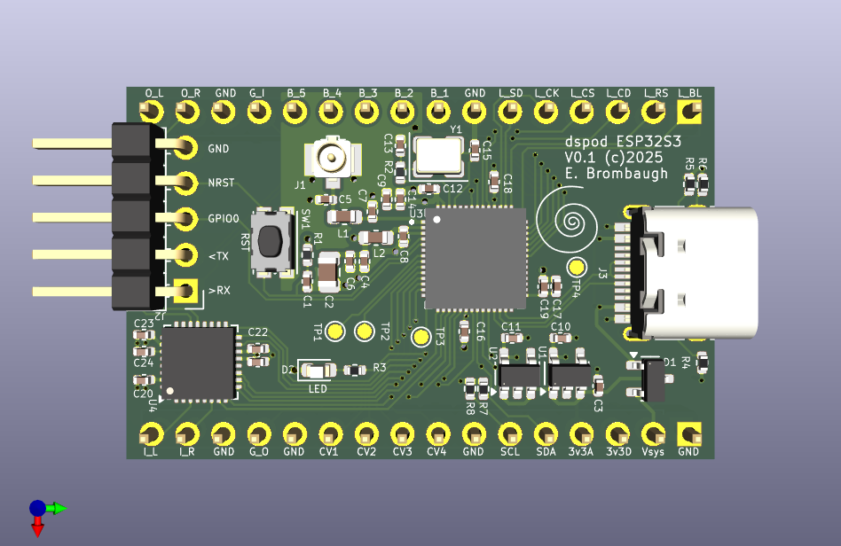

# dspod_rp2350

The dspod_esp32s3 is a daughterboard comprising an ESP32 S3 MCU with 4MB Flash, 2MB PSRAM, USB and GPIO + audio I/O.

## Abstract

This board is a small 32-pin device with the following features:

* ESP32 S3 MCU
  - 56-pin QFN package
  - Dual-core Extensa LX7 CPUs 
  - 512kB SRAM
  - USB, I2C, SPI, ADC, GPIO, WiFi, etc on-chip
* USB-C connector, full-speed host/device
* Nuvoton NAU88C22 stereo codec
* Misc GPIO
  - SPI
  - I2C
  - GPIO
* Four channels of 3.3V multiplexed A/D input
* RF connector for off-board antenna

## Design Materials

* [Schematic](./doc/dspod_esp32s3_sch.pdf)

## Hardware

The hardware design is provided in Kicad 9.x format in the [Hardware](./Hardware) directory.

## Firmware

Firmware is available in the [Firmware](./Firmware) directory.

## Results

The hardware implementation is very similar to an earlier project I did [S3GTA](https://github.com/emeb/S3GTA) so there weren't any big surprises in the overall performance. The CV conversions with the on-chip ADC work fine with a bit of filtering and the encoder/button/LCD-based UI is virtually identical to that on the other three dspod projects so it feels pretty much the same regardless of which instance is in use. The basic effects - filters, delays, reverbs, pitch, frequency and phase shifts - all work the same way and use roughly the right amount of CPU based on their complexity. There are a few aspects of this MCU I'd like to explore further though:

#### RF

I did some simple tests with connecting a uFL WiFi antenna and the basic Espressif tests work fine, scanning the WiFi APs in my area with roughly the same sensitivity as a normal phone or laptop. I can see some RF-connected audio applications that might be fun to try out using this interface that's not available on the other dspod daughterboards.

#### DSP

The Tensilica Extensa CPU cores used in the ESP32S3 are reported to have some DSP and vector capabilities that aren't normally available with standard C coding. There is a DSP library available and the vector extensions may be accessible through that or via assembly code and I'd like to explore if using these resources allows more complex effects than those I've already tried. It would be very interesting to explore spectral effects on such a low-end platform, if FFTs run fast enough.
