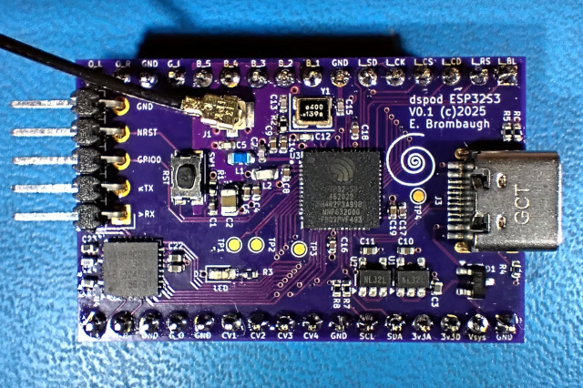

# dspod_esp32s3

The dspod_esp32s3 is a daughterboard comprising an ESP32 S3 MCU with 4MB Flash, 2MB PSRAM, USB and GPIO + audio I/O.

## Abstract

This board is a small 32-pin device with the following features:

* ESP32S3H4R2 MCU
  - 56-pin QFN package
  - Dual-core Extensa LX7 CPUs 
  - 512kB SRAM
  - USB, I2C, SPI, ADC, GPIO, WiFi, etc on-chip
  - 4MB flash in package
  - 2MB PSRAM in package
* USB-C connector, full-speed host/device
* Nuvoton NAU88C22 stereo codec
* Misc GPIO
  - SPI
  - I2C
  - GPIO
* Four channels of 3.3V multiplexed A/D input
* RF connector for off-board antenna

## Design Materials

* [Schematic](./doc/dspod_esp32s3_sch.pdf)

## Hardware

The hardware design is provided in Kicad 9.x format in the [Hardware](./Hardware) directory.

## Firmware

Firmware is available in the [Firmware](./Firmware) directory.

## Results

The hardware implementation is very similar to an earlier project I did [S3GTA](https://github.com/emeb/S3GTA) so there weren't any big surprises in the overall performance. The CV conversions with the on-chip ADC work fine with a bit of filtering and the encoder/button/LCD-based UI is virtually identical to that on the other three dspod projects so it feels pretty much the same regardless of which instance is in use. The basic effects - filters, delays, reverbs, pitch, frequency and phase shifts - all work the same way and use roughly the right amount of CPU based on their complexity. There are a few unique things about this hardware with respect to the other dspod daughterboards though:

#### PSRAM

The ESP32S3 has a QSPI interface for flash and PSRAM that maps these serial devices into the CPU address space like as though it were internal memory (with slow access times). The H4R2 variant has 2MB PSRAM built in and it works well for audio delay buffering without incurring too much processing overhead.

#### Dual Cores

There are two instances of the Tensilica Extensa LX7 CPU core built in and the vendor's FreeRTOS-based development tools make it very easy to use both. The current effects application code does make use of this, running the UI and ADC code on the first core and the audio DSP on the second core - this hasn't made much difference in overall performance as the current audio code is not particularly taxing, but may help in future experiments that push the boundaries.

#### DSP

The LX7 CPUs have hardware floating point and some vector instructions for accelerating math / DSP operations, and the ESP-IDF has a library of optimized assembly routines for common DSP such as transforms, correlations, windowing, etc. and I've done some experiments with their example code to evaluate the performance. Their radix 4 complex FFT is very efficient, doing better on a per-cycle basis than the ARM CMSIS radix 8 FFT that I use in H7R3 spectral effects. Despite this, the slower processor speed (240MHz max) of the ESP32S3 vs the 600MHz STM32H7R3 means that it cannot complete the required operations within the time allowed so it's not a good match for these algorithms. 

#### RF

Naturally, the ESP32 family has WiFi and Bluetooth capability and I've provided hardware on this board to enable experiments with this. There is a 50-ohm matching network onboard and a uFL connector for use with readily available antennas. Early testing with some of the ESP-IDF WiFi examples indicates that RF performance is sufficient to connect to a nearby AP and the usual APs seen in my area by other devices are visible to the dspod with an inexpensive antenna. 

## Going Further

While I've explored most of the highlights, there are a few aspects of this MCU I'd like to explore further:

#### RF

While WiFi performance appears usable, I'd like to experiment with audio streaming via WiFi and using the dspod as a Bluetooth audio device.

#### Algorithms

The current complement of effects algorithms are fairly lightweight so I'm looking forward to trying out some more complex things, and while spectral processing is probably not practical, there is CPU bandwidth and RAM capacity for more complex time domain effects.
