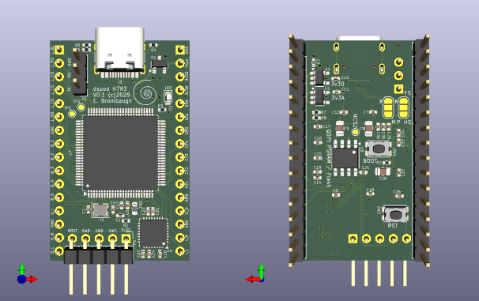

# dspod_h7r3

The dspod_h7r3 is a daughterboard comprising an STM32H7R3V8 MCU with a choice of PSRAM or Flash, USB and GPIO + audio I/O.

## Abstract

This board is a small 32-pin device with the following features:

* STM32H7R3V8 MCU
  - 100-pin LQFP package
  - Arm Cortex M7 CPU at 600MHz max clock
  - 620kB SRAM
  - 64kB Flash
  - USB, I2C, SPI, ADC, GPIO, etc on-chip
* USB-C connector, high-speed or full-speed host/device and power
* SOIC-8 flash or PSRAM (or both!)
* Nuvoton NAU88C22 stereo codec
* Activity LED
* 3.3V level serial for debug / status
* SWD for flashing / debug
* IO routed to 0.1inch headers:
  - SPI
  - I2C
  - GPIO
  - Analog
  - Audio
  - Power
* Four channels of 3.3V multiplexed A/D input
* Stereo line-level audio I/O
* Pushbuttons for Reset and Boot mode.

This board is test to see how well this new, faster version of the STM32H7 performs - with a clock speed of 600MHz max and plenty of on-chip SRAM it may work well for 'bare-metal' audio DSP. The downside is that it has very limited flash memory which will put a squeeze on the amount of code that can run on-chip. To compensate, a single channel of QSPI to an external device is provided which can host either a large flash memory (up to 128MB is available in this package) or an 8MB PSRAM which can be used for audio buffering. An optional chip select is brought out for experiments with stacking both flash and PSRAM - more on this after hardware is on the bench.

## Design Materials

* [Schematic](./doc/dspod_h7r3_sch.pdf)

## Hardware

The hardware design is provided in Kicad 9.x format in the [Hardware](./Hardware) directory.

## Firmware

Firmware projects for testing the various subsystem drivers are provided in the [Firmware](./Firmware) direcory.

## Results

I was interested in trying out the STM32H7R3 primarily due to its clock speed rating which at 600MHz is higher than other STM32H series parts. Additionally it provides a high-speed USB interface with an on-chip HS PHY that had not been available in lower pincount devices previously. Since I already have an extensive library of drivers and application code for STM32 devices it seemed like this would be a quick system to bring up, but experience has proven otherwise.

#### Programming

The first hurdle to overcome was how to get code into the device since the H7R/S series parts have new IDs and slightly different programming protocols that weren't yet supported by the various SWD interfaces that I have. Mainline OpenOCD does not yet have target scripts for the H7R/S nor does the Black Magic Probe. After some testing I was able use a forked version of OpenOCD provided by ST - more detail on setting this up is in the README file of the Firmware directory.

#### DMA

Previous projects I'd done with STM32H7 devices had used the "old style" DMA subsystem that hadn't really changed much since the days of the STM32F1xx. The H7R3 however has a new GPDMA subsystem that requires a rather different configuration and presents a few hurdles when combined with caching. In particular, GPDMA requires linked-lists of descriptors in SRAM to control its operation and these require careful handling when cache is enabled.

#### Cache and MPU

The Cortex M7 include cache and memory protection which should work together to optimize memory accesses. I have compile time switches in my firmware source to try various combinations of these features and have found that while using them is generally reliable and leads to significant improvements in execution speed, some combinations can result in faults that hang the system. The causes are sometimes hard to discover and can change as seemingly unrelated parts of the firmware are modified. More work is needed to fully understand this.

#### XSPI

This project includes options for several different types of quad-width external serial memories. Earlier projects have successfully explored the use of QSPI PSRAMs for buffering audio data but these used "indirect mode" where the external device is treate as a SPI device where reading and writing require the CPU to manage the bus transactions through the HAL API. The H7R3 has a new "XSPI" port that allows the address space of the external device to be mapped into the CPU's memory space, allowing reading and writing without specifically managing the bust transactions. Although some example code for this is available, it's not tailored for the specific devices that I'm using and I've not been able to get it memory mapped mode working reliably in my hardware so I've fallen back to using indirect accesses. There are examples of both of these methods available in the Firmware/app directory.

#### Flash

The H7R3 is intended for systems that employ external flash connected via the XSPI port and consequently it has only 64kB of on-chip flash memory which is intended for only small applications, or as a bootloader for code stored off-chip which is either loaded into on-chip SRAM or "execute in-place" (XIP) via the memory-mapped mode of the XSPI port. External QSPI flash and XIP operation has been verified.

For small applications that fit into the on-chip flash it's not necessary to deal with XSPI or the linker and programming complications that result so development is fairly simple. The downside of course is that one is limited to just 64kB of code. 

For larger applications there are a number of barriers to overcome:

- Setting up linker scripts that properly assign the code to external memory.

- Creating a bootloader that sets up the XSPI peripheral and vectors execution to the code stored in external memory.

- Configuring the programming tool to allow reading and writing of the external memory with the binary output of the build tools. This will be unique to every project.

Programming and booting are nicely handled using the [TinyUF2](https://github.com/adafruit/tinyuf2) bootloader, specifically targeted at the dspod_h7r3. It handles programming the external flash memory via a user-friendly drag & drop USB mass storage interface and jumps directly to the user application in the external memory when it's available. I've got this working reliably in both USB full-speed and high-speed modes and even have it reasonably well integrated into my development flow for hands-off flashing. Read more about this in the Firmware section.

#### USB

[TinyUSB](https://docs.tinyusb.org/en/latest/index.html) has support for STM32H7RS family parts in its latest releases so it wasn't too hard to get some of the example code up and running. I forked it and added BSPs for the dspod_h7r3 in both full and high-speed modes. Note that although TinyUSB can drive both, the out-of-box configuration was set up to assume high-speed only for the STM32H7RS family and a minor modification to the main source was needed to allow the BSP to select which was used. My fork is available here: [GitHub - emeb/tinyusb](https://github.com/emeb/tinyusb) - be sure to use the `dspod_h7r3` branch. I've got board-support targets for both the full-speed port `BOARD=dspod_h7r3` and the high-speed port `BOARD=dspod_h7r3_hs` and they both work just fine.

#### Quirks

There are a number of subtle details in the operation of the H7R3 that may not be immediately obvious:

- Some SRAM is on the AHB rather than AXI bus and the AHB SRAM has clock enable bits that must be set before it can be used.

- There are several new GPIO ports (M-P) that are associated with the XSPI and USB peripherals and these have control bits that need to be enabled in the PWR registers before they can be used.

- There are a number of on-chip voltage regulators and power management features that depend on the package type. In the LQFP100 that is used on the dspod-h7r3 most of these are not available due to pin limitations but default settings in the PWR registers aren't quite right for that package. In particular one of the voltage regulator settings must be changed in order to run the device at its maximum 600MHz clock rate.

#### DSP Performance

Running the same algorithms as used on the the other platforms (CV1800B, RP2350) the STM32H7R3 significantly outperforms them. In particular the spectral phase vocoder effect uses only 35% of CPU on the H7R3 (600MHz, ARM Cortex M7, bare metal) compared to over 50% on the CV1800B (1GHz RISC-V linux). 

## TBD

At this point I've exercised all of the fundamental features that I wanted to try so the only remaining project is a fully-featured audio effects application with time and frequency domain algorithms and other essential features like tap tempo, setting storage, etc. That's a job for future me.
