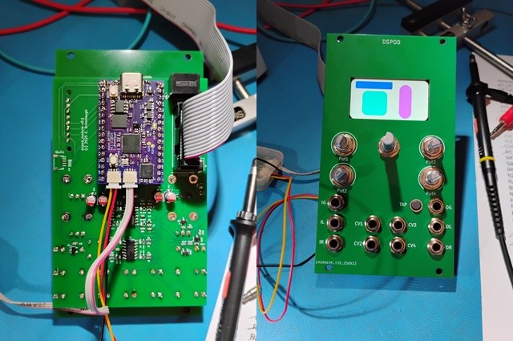

# dspod_module
This directory contains the design collateral for the dspod_module

## Abstract
The dspod_module is a Eurorack module that acts as a motherboard / carrier for
the various dspod daughterboards. It provides the following resources:
* Eurorack front panel
* Eurorack power supply with 5V, and +/-12V
* 320 x 170 IPS LCD with ST7789 controller in SPI mode
* 4x 3.3V CV interfaces with 3.5mm input jacks and offset pots
* 2x +/-7V stereo audio inputs
* 2x +/-7V stereo audio outputs
* 1x trigger/gate input with 3.3V logic level buffer
* 1x trigger/gate output with 3.3V -> 5V logic level buffer
* Quadrature rotary encoder w/ pushbutton.

## Design
The design materials are available in Kicad 9.0 format, including schematic and
PCB layout.

* [schematic](./doc/dspod_module_schematic.pdf)

