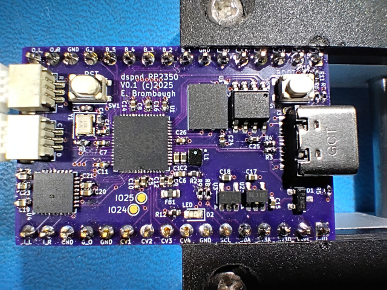

# dspod_rp2350

The dspod_rp2350 is a daughterboard comprising an RP2350A MCU with 4MB Flash, 8MB PSRAM, USB and GPIO + audio I/O.

## Abstract

This board is a small 32-pin device with the following features:

* RP2350 MCU
  - 68-pin QFN package
  - Dual-core Arm Cortex M33 or Hazard3 RISC-V CPUs 
  - 520kB SRAM
  - USB, I2C, SPI, ADC, GPIO, PIO, etc on-chip
* USB-C connector, full-speed host/device
* Nuvoton NAU88C22 stereo codec
* Misc GPIO
  - SPI
  - I2C
  - GPIO
* Four channels of 3.3V multiplexed A/D input

## Design Materials

* [Schematic](./doc/dspod_rp2350_sch.pdf)
* [BOM Spreadsheet](./doc/dspod_rp2350_BOM.ods)

## Hardware

The hardware design is provided in Kicad 9.x format in the [Hardware](./Hardware) directory.

## Firmware

A collection of test programs for exercising all the peripherals of the dspod_rp2350 can be found in the [Firmware](./Firmware) directory.
