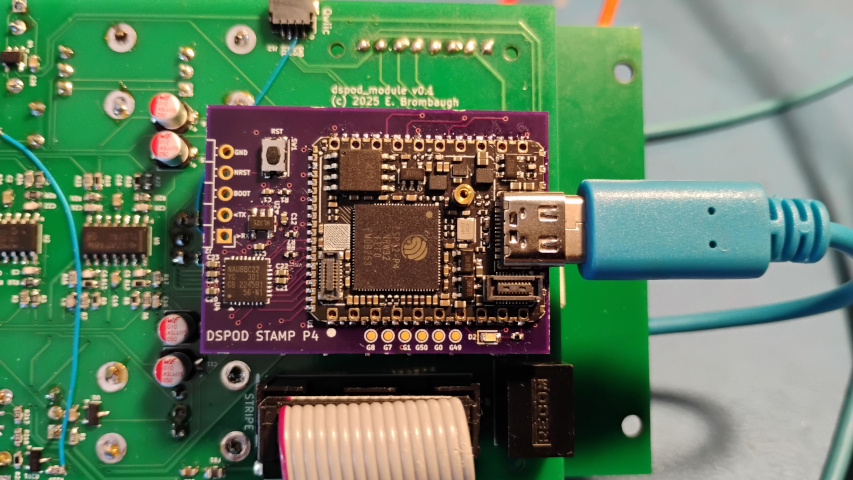

# dspod_stampp4

The dspod_stampp4 is an audio daughterboard based on the M5Stack Stamp P4 which provides n ESP32 P4 MCU with 4MB Flash, 32MB PSRAM, USB and GPIO. The M5Stack module is used because the bare ESP32P4 devices were not available from the usual hobbyist distribution channels at the time of development. The primary motivation was to see if the faster dual-core RISC V architecture provided any meaningful performance benefit.

## Abstract

This board is a small 32-pin device with the following features:

* M5Stack Stamp P4 module containing 
  - ESP32S3H4R2 MCU
    - 68-pin QFN package
    - Dual-core RISC V CPUs 
    - 768kB SRAM
    - 32MB PSRAM in package
    - USB, I2C, SPI, ADC, GPIO, etc on-chip
  - 16MB QSPI flash
  - USB-C Connector for development
  - Various connectors for MIPI, SD
* Nuvoton NAU88C22 stereo codec
* Misc GPIO
  - SPI
  - I2C
  - GPIO
* Four channels of 3.3V multiplexed A/D input

## Design Materials

* [Schematic](./doc/dspod_stampp4_sch.pdf)

## Hardware

The hardware design is provided in Kicad 9.x format in the [Hardware](./Hardware) directory.

## Firmware

Firmware is available in the [Firmware](./Firmware) directory.

## Results

The hardware implementation is very similar to the [dspod_esp32s3](../dspod_esp32s3/README.md) so there weren't any big surprises in the overall performance. The encoder/button/LCD-based UI is virtually identical to that on the other three dspod projects so it feels pretty much the same regardless of which instance is in use. The basic effects - filters, delays, reverbs, pitch, frequency and phase shifts - all work the same way and use roughly the right amount of CPU based on their complexity. Some minor changes were required to the ADC and I2S hardware driver code due to the differences between ESP-IDF V5.x and V6.x, as well as migrating from Extensa to RISC-V CPU architecture.

Overall, the faster CPU cores (360MHz RISC V vs 240MHz Extensa LX7 on the ESP32 S3) didn't make a huge difference in DSP performance and the modest speedup in the algorithms that run exclusively from on-chip memory wouldn't be a strong motivator for choosing the P4 vs the S3.

Hardware-wise, using the pre-build module with castellated pads presented some additional assembly challenges, most notably that the module does not fit between the  two rows of pin headers in the dspod physical standard so it was necessary to use SMT pin headers soldered to the bottom side of the board which was difficult to align properly in order to ensure the board would plug into the dspod_module. That aside, having all the small SMT components pre-assembled on the module did make frontside assembly much simpler.

## Going Further

While I've explored most of the highlights, there are a few aspects of this MCU I'd like to explore further:

#### CPU Cores

Pushing the RISC V CPU cores harder and trying some of the more advanced math features would be interesting.

#### Algorithms

The current complement of effects algorithms are fairly lightweight so I'm looking forward to trying out some more complex things, and while spectral processing is probably not practical, there is CPU bandwidth and RAM capacity for more complex time domain effects.
